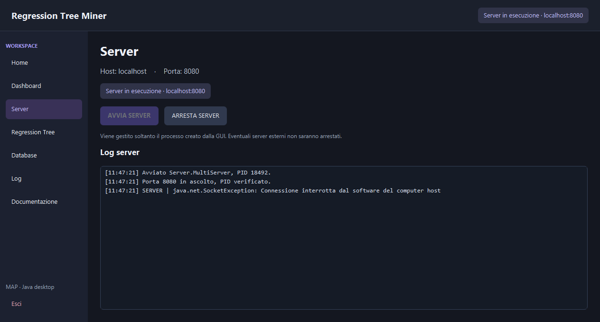
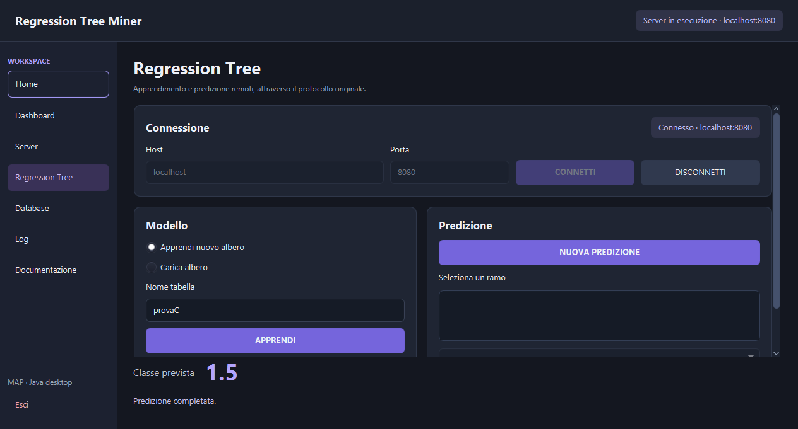

# Guida utente

## 1. Preparazione iniziale

Estrarre lo ZIP e aprire la cartella `RegressionTreeMiner`.
Controllare JDK 21 con `java -version` e `javac -version`.
Da PowerShell compilare tutti i progetti:

```powershell
powershell.exe -NoProfile -ExecutionPolicy Bypass -File scripts/build.ps1
```

Attendere che tutte e tre le compilazioni terminino con successo.
Non occorre installare JavaFX, perché il SDK Windows x64 è incluso.

## 2. Avvio database

Avviare MySQL su localhost:3306. Se il database non è già preparato, leggere
`database/setup.sql` e aprirlo in Workbench con un account amministrativo.
Lo script **sostituisce provaC** e configura l'account didattico MapUser/map:
eseguirlo solo se tali operazioni sono accettabili.
Verificare i risultati finali: 15 righe fisiche e 9 tuple distinte.

## 3. Avvio applicazione

```powershell
powershell.exe -NoProfile -ExecutionPolicy Bypass -File mapGui/scripts/run.ps1
```

La finestra può essere spostata, ridimensionata, minimizzata e massimizzata
con i comandi normali del sistema operativo. Alle dimensioni più piccole
scorrere verticalmente le pagine lunghe.

## 4. Home e Dashboard

Premere **Avvia applicazione** per aprire la Dashboard.
Usare le card o la sidebar per scegliere Server, Regression Tree, Database,
Log o Documentazione. Home torna alla schermata iniziale.

## 5. Avvio server

Aprire Server e premere **Avvia server**.
Attendere lo stato Server in esecuzione e la verifica della porta 8080.
Se la porta è occupata, non forzare l'arresto di altri processi: un server già
avviato manualmente può essere usato direttamente dalla schermata Tree.



## 6. Apprendimento nuovo albero

1. Aprire Regression Tree.
2. Lasciare Host `localhost` e Porta `8080`.
3. Premere **Connetti** e attendere Connesso.
4. Selezionare **Apprendi nuovo albero**.
5. Inserire `provaC` nel campo Nome tabella.
6. Premere **Apprendi** e attendere l'esito positivo.

Non inserire un percorso dataset nel campo tabella: il training set finale
viene acquisito dal database.

## 7. Predizione

1. Premere **Nuova predizione**.
2. Leggere la domanda e i rami inviati dal server.
3. Selezionare dalla ComboBox oppure digitare l'indice.
4. Premere **Conferma** per ogni domanda.
5. Leggere **Classe prevista** in basso.

Per provaC sono verificati questi percorsi:

| Risposte alle QUERY | Risultato |
| --- | --- |
| 0 poi 0 | 1.0 |
| 0 poi 1 | 1.5 |
| 1 | 10.0 |

Gli indici identificano i rami mostrati dal server. Non sono valori di X/Y
da inserire senza leggere la domanda. Per ripetere usare Nuova predizione;
per annullare una domanda pendente usare Disconnetti.



## 8. Caricamento archivio

Con il client connesso, selezionare **Carica albero**, indicare il percorso
di un archivio compatibile e premere Carica. Learn non crea automaticamente
questo file: l'archivio deve essere stato prodotto tramite `RegressionTree.salva`.

Il percorso è interpretato **dal server**. Sfoglia seleziona un file locale:
non lo invia in rete. È adatto a un server sullo stesso computer; con server
remoto inserire un percorso accessibile su quel computer.
Usare soltanto archivi affidabili. Dopo Load riuscito si può predire come
dopo Learn.

## 9. Database, documentazione e log

In Database, **Verifica MySQL** controlla soltanto la porta TCP 3306.
Un risultato positivo non dimostra autenticazione, permessi o disponibilità
di MapDB. **Apri script SQL** apre il file, senza eseguirlo.

Log mostra output server e diagnostica tecnica; Pulisci log svuota la
visualizzazione. I log e lo stato server non si perdono cambiando schermata.
Documentazione permette di aprire il README principale e la guida JavaFX
con l'applicazione associata ai file Markdown nel sistema.

## 10. Arresto corretto

- Per chiudere la sessione client premere **Disconnetti**.
- Per fermare il server della GUI usare **Arresta server**.
- Per uscire usare **Esci** oppure chiudere normalmente la finestra.

La chiusura arresta solo il server avviato dalla GUI e rilascia la sessione.
Un server esterno/manuale e MySQL non vengono fermati. Per un server manuale
usare Ctrl+C nel suo terminale.

## 11. Problemi comuni

| Sintomo | Azione |
| --- | --- |
| java/javac non riconosciuto | Rendere disponibile il JDK 21 nel PATH |
| Classi server non disponibili | Ripetere scripts/build.ps1 |
| JavaFX SDK assente | Verificare l'estrazione completa di mapGui/lib |
| Porta 8080 occupata | Non avviare due server; connettersi a quello esistente |
| Server non raggiungibile | Controllare stato, host, porta e firewall |
| MySQL non raggiungibile | Avviare il servizio e controllare la porta 3306 |
| Learn fallisce nonostante TCP raggiungibile | Verificare account didattico, MapDB, SELECT e provaC |
| Archivio non trovato | Controllare il percorso sul server |
| Ramo non valido | Avviare nuova predizione e scegliere un indice della QUERY |
| Documento non aperto | Aprire manualmente il README con un editor Markdown |

Per usare il client console senza GUI: avviare il server manuale e poi
`scripts/run-client.ps1`. Selezionare `1`, digitare `provaC`, rispondere alle
QUERY e usare `n` per terminare.
